# 🤖 Kai (ಕೈ): A 5 Degree of Freedom Robotic Arm

Welcome to **Kai (ಕೈ)** — my latest hobby project and a significant step forward in my robotics journey. Kai (ಕೈ), meaning "hand" in Kannada, is a 5-DOF robotic arm built as a natural progression from my 3DOF project. With improved dexterity, orientation control, and a modular design, this DIY robotic arm project explores robotics, control systems, and embedded programming.
<p align="center">
    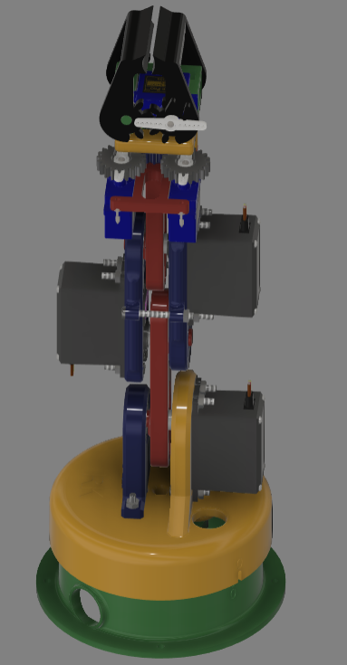
    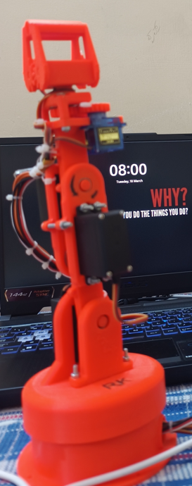
</p>

## 🔁 Previous Version: 3DOF Arm (V01)

Before building Kai (5DOF), I developed a 3DOF robotic arm as a foundational project. You can check it out here:

🔗 [Robotics-Arm-Project-V01](https://github.com/RKTheOneAndOnly/Robotics-Arm-Project-V01)

This earlier version helped me explore servo control, basic kinematics, and get hands-on with 3D printing and embedded design.

---
## Table of Contents

1. [Introduction](#1-introduction)
2. [Components Used](#2-components-used)
3. [Assembly Instructions](#3-assembly-instructions)
4. [Wiring Diagram](#4-wiring-diagram)
5. [Code Overview](#5-code-overview)
6. [Robot Video](#6-robot-video)
7. [Future Plans](#7-future-plans)
8. [License](#8-license)
9. [Repository Structure](#9-repository-structure)
10. [Credits & Acknowledgements](#10-credits--acknowledgements)

---
## 1. Introduction

This project focuses on designing, assembling, and controlling a 5DOF robotic arm that is:
-  Fully 3D printable
-  Made using easily available components
-  Controlled via inverse kinematics (IK) using Python + IkPy
-  Powered by ESP32 & PlatformIO, with web-based remote control
-  Open-source for learners, hobbyists, and engineers

---
## 2. Components Used

A detailed Engineering Bill of Materials (EBOM) is provided [here (Excel)](docs/Bill_of_Materials-5_DOF_Robot.xlsx).

| Component        | Quantity | Notes                      |
|------------------|----------|----------------------------|
| MG995  Servos    | 1        | High torque servo motors   |
| MG996R Servos    | 4        | High torque servo motors   |
| ESP 32           | 1        | Main controller            |
| PCA 9685         | 1        | Servo driver (I2C)         |
| 5V Power Supply  | 1        | Power source for servos    |
| 3D Printed Parts | ~10      | Provided in `/stl` folder  |
| Misc. Hardware   | -        | Screws, bearings, etc.     |

---
##  3. Assembly Instructions

The robotic arm is composed of modular, 3D-printed PLA joints designed for ease of assembly. Printing parameters such as infill density are provided in the [Bill of Materials (BOM)](docs/Bill_of_Materials-5_DOF_Robot.xlsx).

> 📌 **Note**: The part names used in these instructions match the file names available in the [STL](./stl) folder.

Follow the steps below to assemble **Kai**:

---

### 1. **Base Setup**
Mount the base servo motor (`MG995`) into the `BASE` structure. Insert ball bearings into their respective housings to reduce rotational friction. The base includes cutouts to route wires neatly and prevent tangling during rotation.

---

### 2. **Rotary Base Assembly**
Attach the `ARM-1-MAIN` component to the `BASE`. Ensure the base servo is positioned at **90°**, and align the zero markers on both `BASE` and `ARM-1-MAIN` for proper orientation.

---

### 3. **Support Arm & Second Servo Installation**
Fix the support arm `ARM-1-AUX` onto `ARM-1-MAIN` using screws. This component provides structural support via its bearing housing. Mount the second MG995 servo into `ARM-1-AUX`.

---

### 4. **Attaching the First Arm**
Connect `ARM-2` to the second servo motor (`MG996R`). Ensure the servo is set to **90°** before coupling to maintain consistent mechanical zeroing. The `ARM-2` component includes a boss feature that rides on the bearing within `ARM-1-AUX` to enhance rigidity and stability of the robot.

---

### 5. **Assembling the Second Arm**
Join `ARM-3-1` and `ARM-3-2` using two servo motors (`MG996R`) and screws. These parts include bearing housings that support both `ARM-2` and the upcoming `ARM-4` assembly. Once assembled, connect the complete second arm (`ARM-3-1` and `ARM-3-2` with servos) to `ARM-2` as shown in the reference images.

---

### 6. **Wrist Mechanism & Third Arm**
Mount `ARM-4` to the end of the second arm (`ARM-3`). Attach **two SG-90 micro servos**, which jointly drive a gear mechanism responsible for **wrist rotation (5th DOF)**. The mechanism is supported by bearings and features a square drive shaft for the gripper interface.

---

### 7. **Gripper Installation**
Fix the 3D-printed gripper to the square shaft of the wrist gear mechanism using screws. The gripper is actuated by a single `SG-90` micro servo, enabling open-close functionality. Ensure proper alignment for smooth operation.

---

### Step-by-Step Assembly Images

| Step | Image |
|------|-------|
|1) **Base & Bearings** | 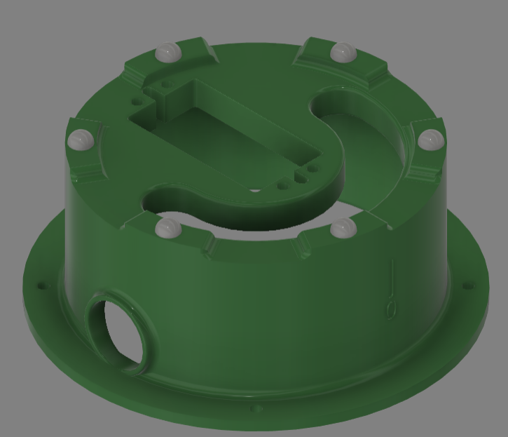 |
|2) **Base Motor Assembly**| 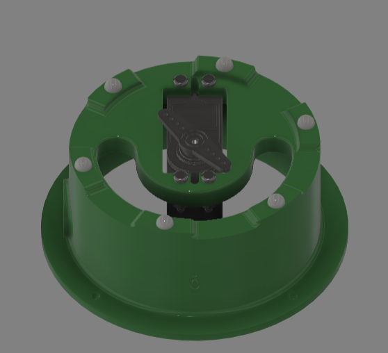 |
|3) **Arm 1 Assembly** | 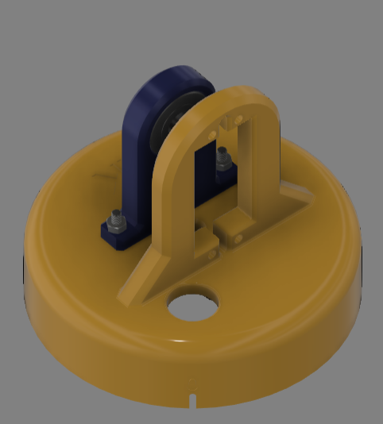 |
|4) **Arm 2 Assembly** | 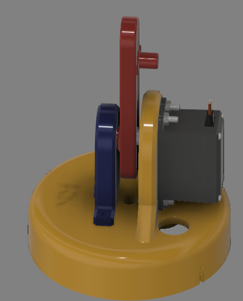 |
|5) **Arm 3 Assembly** | 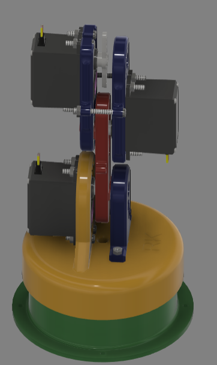 |
|6a)**Wrist Gearing (a)** | 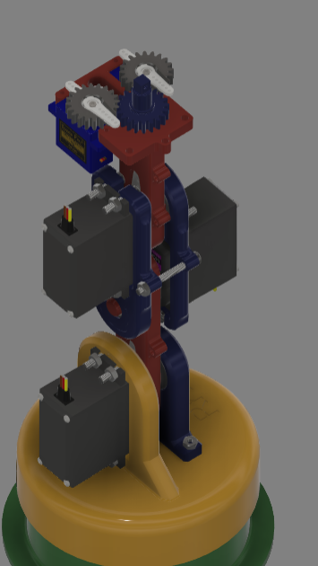 |
|6b) **Wrist Gearing (b)** | 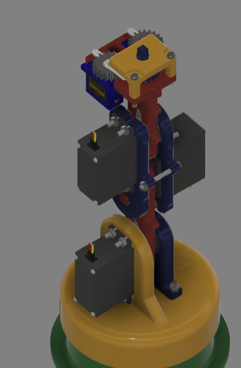 |
|7) **Gripper & Final View** |  |

> 🔧 **Tip**: Always set servos to **90°** before mechanical assembly to ensure consistent zeroing. This greatly simplifies motion planning and inverse kinematics calculations.

---

## 4. Wiring Diagram

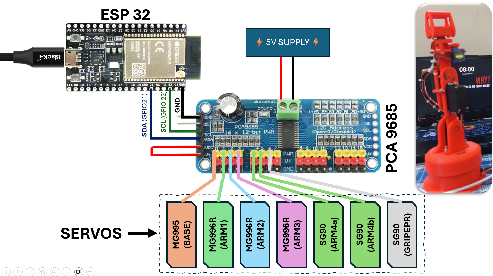  
*Wiring layout showing servo connections, PCA9685, ESP32 pinout, and external power supply.*

---

###  Key Wiring Details:

1. **Servo Connections**  
   A total of **7 servo motors** are used in this project. These are connected to a **PCA9685 16-channel PWM driver**, which is interfaced with the ESP32 via the **I2C** protocol.

2. **Microcontroller Interface**  
   The **ESP32** handles communication and control. I2C lines (SDA and SCL) from the ESP32 are connected to the corresponding inputs on the PCA9685.

3. **Power Supply**  
   An **external 5V power supply** is used to power the servos. Ensure that the **ground (GND)** of the power supply is **shared** with both the ESP32 and the PCA9685 module.

---

##  5. Code Overview

This project is powered by a combination of embedded C++ (via PlatformIO) and Python scripts, enabling high-level control, real-time kinematics solving, and remote web-based interfacing.


###  Inverse Kinematics Solver (Python)

- **Library Used**: [IkPy](https://github.com/Phylliade/ikpy)  
- **URDF Model**: The robot's kinematics are defined using a custom **URDF file**.
- **Functionality**:  
   - Accepts Cartesian goal position (x, y, z, orientation).
   - Solves inverse kinematics using the robot's URDF.
   - Outputs an array of 7 servo angles, ready to be sent to the microcontroller.

> 📁 Code Path: [`/code/src/Inverse_Kinematics_Controller.py`](./code/src/Inverse_Kinematics_Controller.py)

> 📁 URDF Path: [`/code/URDF_FIVE_DOF.urdf`](./code/URDF_FIVE_DOF.urdf)


---

### Web-based Remote Controller

The robot can be controlled manually using a web-based user interface hosted by a **Python Flask** server. This controller provides an intuitive and responsive way to articulate **Kai** in real-time without needing any complex tools.

- **Framework**: Python Flask  
- **Functionality**:
   - Hosts a local webpage with slider-based and button-based controls.
   - Sends real-time position and orientation inputs from the browser to the backend.
   - The backend converts these inputs to joint angles and sends them to the ESP32 for actuation.

> 📁 Code Path: [`/code/src/Online_Controller.py`](./code/src/Online_Controller.py)

The interface is designed to allow smooth and user-friendly manipulation of the robot. A preview of the controller is shown below:

<p align="center">
  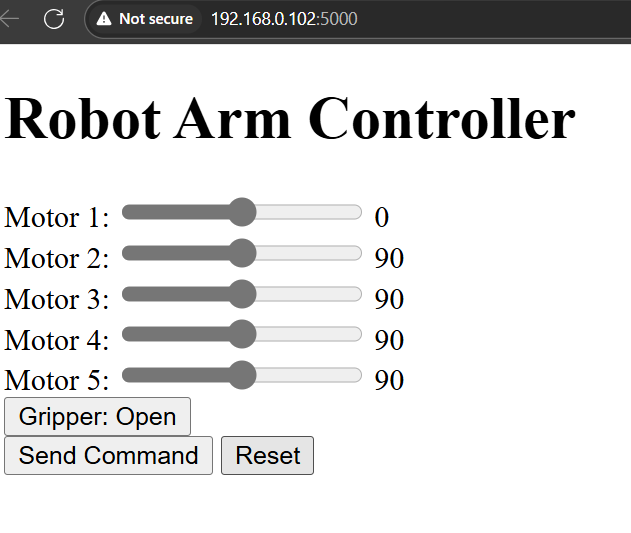
</p>

---
## 6. Robot Video

Here’s a glimpse of **Kai – the 5DOF Robotic Arm** in action!

The robot performs real-time pick-and-place tasks and orientation-based manipulation using servo-driven joints controlled via a inverse kinematics controller. The video showcases the robot arm demonstrating smooth motion control, coordinated joint movement, and precise end-effector positioning. 

This demonstration highlights Kai’s capabilities in workspace articulation, grip control, and stable motion handling — all built using affordable components and open-source tools.
Here are some demonstration videos of Kai (ಕೈ) in action:

> To watch demonstration videos of Kai (ಕೈ), please use the direct links below:

- [Video 1 – Orientation Control Demo](docs/Videos/Vid_1.mp4)
- [Video 2 – Pick and Place Demo](docs/Videos/Vid_2.mp4)


## 7. Future Plans

- Integrate camera for visual pick-and-place
- Full ROS2 implementation (RViz + MoveIt)

## 8. License

Licensed under the **GNU General Public License v3.0 (GPL-3.0)**.  
See the [LICENSE](./LICENSE) file for full details.

## 9. Repository Structure
```bash
5-DOF-Robotic-Arm-RK/
├── code/
│   ├── .pio/
│   ├── src/
│   │   ├── templates/
│   │   ├── Inverse_Kinematics_Controller.py
│   │   ├── Online_Controller.py
│   │   └── main.cpp
│   ├── URDF_FIVE_DOF.urdf
│   └── platformio.ini
├── docs/
│   ├── Photos/
│   ├── Videos/
│   ├── Bill_of_Materials-5_DOF_Robot.xlsx
│   └── robot_arm.yaml
├── stl/
├── LICENSE
└── README.md

```
## 10. Credits & Acknowledgements

Special thanks to:

- [IkPy](https://github.com/Phylliade/ikpy) – for providing an easy-to-use inverse kinematics library.
- [PlatformIO](https://platformio.org/) – for simplifying embedded development and dependency management.
- The open-source robotics community – for the abundance of shared knowledge, tools, and inspiration.

> *Crafted with ❤️, driven by curiosity, and fueled by innovation.*
